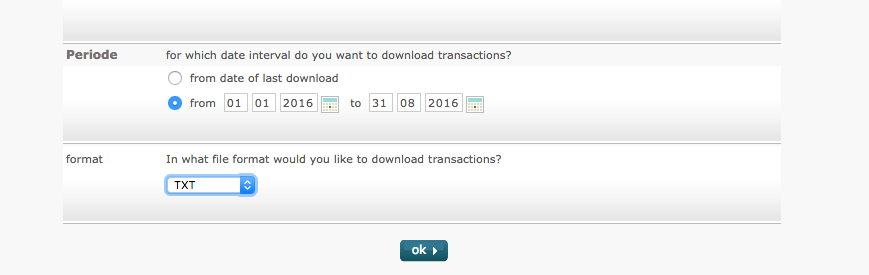

# ABN Amro Transactions

Docker image to download bank account transactions 
from [ABN Amro](https://www.abnamro.nl) internet banking.

## Rationale
As of now (September 2016), ABN Amro doesn't provide API to expose a list
of transactions. This tool is a workaround around the missing API. It uses a headless
Chrome browser and Selenium to log into the ABN Amro internet banking and download
the CSV with transactions. 

The tool uses the following screen to download a list of transactions:

 

## Usage

```bash
docker run \
  --rm 
  --env ABNAMRO_ACCOUNT_NUMBER="[account_number]" \
  --env ABNAMRO_CARD_NUMBER="[card_number]" \
  --env ABNAMRO_IDENTIFICATION_CODE="[identification_code]" \
  --volume [download-dir]:/data \
  --privileged -v /dev/shm:/dev/shm
  mkrcah/abnamro-tx:latest \
  --period-from="[period-from]" --period-to="[period-to]"
```

where
- `account_number`, `card_number` and `identification_code` are login credentials. Not that you have to have the PIN-login enabled.
- `period-from` and `period-to` defines time filter for transactions, in format `YYYY-MM-DD`
- `download-dir` a directory where the CSV file with transactions will be saved

There is an optional argument available:
- `--export-filename [filename]` which specified name of the downloaded CSV file, e.g. `"abnamro.csv"`

Login credentials can be also supplied via a file using the [`--env-file` flag](https://docs.docker.com/engine/reference/commandline/run/#/set-environment-variables-e-env-env-file).

Note: `--privileged -v /dev/shm:/dev/shm` is required in order for Chromium to start 
## Example:

```
$ cat env.list
ABNAMRO_ACCOUNT_NUMBER=04123456
ABNAMRO_CARD_NUMBER=111
ABNAMRO_IDENTIFICATION_CODE=123123

$ docker run --env-file=env.list \
   --volume $(pwd)/export-data:/data \ 
   --privileged mkrcah/abnamro-tx \ 
   --period-from "2016-01-01" --period-to "2016-08-31" \
   --export-filename "abnamro.csv"
Starting chrome...
Loading login page
...
Done!


$ ls ./export-data
abnamro.csv
```

## Alternatives

- Python library, without the need of a headless browser: https://github.com/djc/abna

## Troubleshooting

Try to open internet banking manually and fill in provided data.
If not, try installing selenium and running the script locally.
If that doesn't help, or you find yourself lost, please open an issue.

## License
[MIT](http://choosealicense.com/licenses/mit/)


